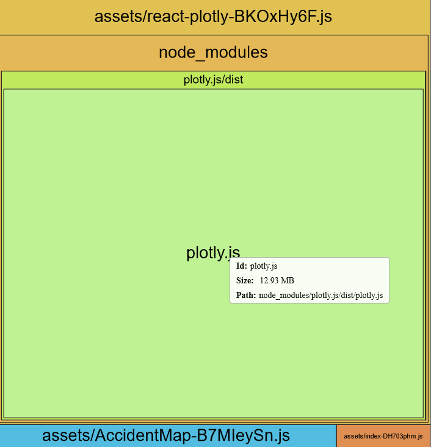
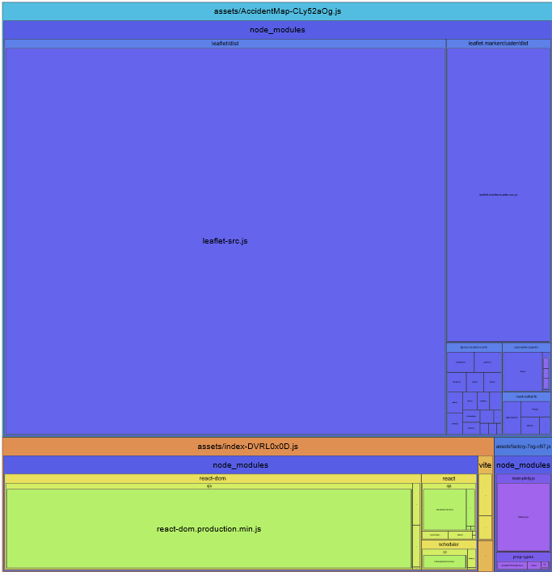
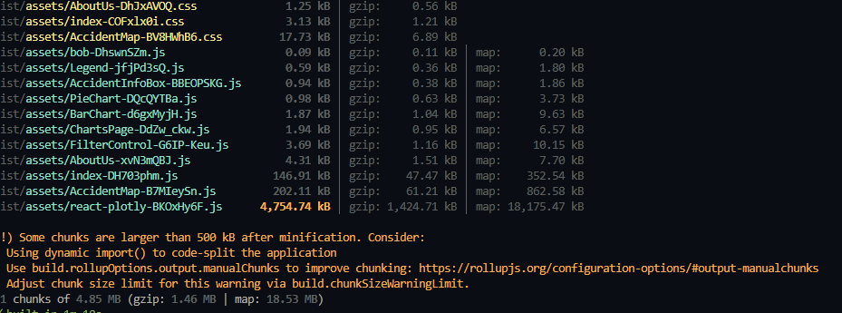
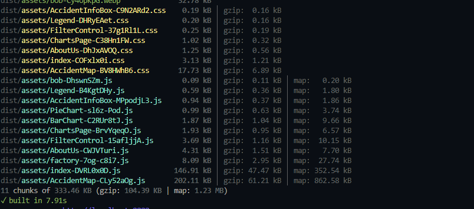

# Performance of WeatherWreck
## Introduction and Methodology
<!-- Briefly state how you gathered data about app performance, and in what environment 
(which browsers, what browser versions, what kind of device, OS,
width and height of viewport as reported in the console with `window.screen`) -->

<!-- Also report overall impact on whatdoesmysitecost results before and after all your changes -->
1. We first ran the lighthouse on the server side webpage (in Chrome) and checked the performance for each view on the desktop device.
2. We also ran the lighthouse on the AWS and Render deployments so like that we can see the differences on the desktop device.  
3. We mostly used the lighthouse but we also put the URL of the 2 deployments on the [WebPageTests](https://www.webpagetest.org) to see the results from there as well.

### Impact on [whatdoesmysitecost](https://whatdoesmysitecost.com/)
For the _AWS_ the result **before** our changes, for Canada was 0.29 USD Dollars.  
**TO DO AWS results after**

Unfortuanlly we forgot to check the results for the _Render_ deployments before our changes, so we don't have it the prices before it.  
**TO DO Render results after** 

## Baseline Performance
**TO DO - Possibly forgot to add something in here?**
<!-- Summarize initial results for each tool that you used. Did the tools
detect all the performance issues you see as a user? -->
### For the AWS - Lighthouse
For the Accidents Map Page the initial results was a 32 on mobile device (I don't think we initially run it for the desktop device).  
For the Charts Page the initial results was a 31 on mobile device (I don't think we initially run it for the desktop device).  
We think that the results from the lighthouse were accurate because it was mostly about how slow our website was.  

### For the Render - Lighthouse
For the Accidents Map Page the initial results was a 31 on mobile device (I don't think we initially run it for the desktop device).  
For the Charts Page the initial results was a 3o on mobile device (I don't think we initially run it for the desktop device).  
We think that the results from the lighthouse were accurate because it was mostly about how slow our website was.  

## Areas to Improve
* Fix Database Performance:
  * Make it so that loading time takes less time.
* Render Less Markers
  * Render less markers on the map so we can have a better LCP
* Change Image Format (PNG)
  * Transform images into the webp format so we can improve the load speed and LCP metrics
* Compress Text Resources
  * Compress text-based resources so we can have the better payload size and faster load time
* Cache Endpoint Responses
  * Cache the data fetched by API endpoints so like that we can improve the speed of the response time
* Prefetch Critical Resources
  * Preload resources like the favicon and the loading image (bob.webp) so like this we can fix the network latecy
* Cache Static Files 
  * This causes unnecessary network requests which increses the load time
* Unused Libraries
  * Fix the bundle size by getting rid of any unused JavaScript code but it's still being included in the vite bundler
* Largest Contentful Paint
  * Lazy-Load any components that are not needed right away
* Large Layout Shift
  * Modify the css and fix any mistakes in the components that could cause this issue

## Summary of Changes 
<!-- Briefly describe each change and the impact it had on performance (be specific). If there
was no performance improvement, explain why that might be the case -->
### Change 1 - Fix Database Performance
Lead: Iana Feniuc.  
Our database performance is very slow. It fetches too much data which makes it too slow for the first loading operation.  
We made the db query (generalFetchEventsAndAccidents) to fetch only 2 results by state.   
This speed up the initial loading time by 2 seconds.  

### Change 2 - Inefficient Marker Rendering
Lead: Iana Feniuc.  
Rendering a large number of markers on the map caused significant performance degradation, especially on slower devices.  
Each marker created adds more computations for rendering, leading to slow interactivity and longer Largest Contentful Paint (LCP) times.  
We implemented the MarkerClusterGroup functionality provided by the react-leaflet-markercluster library.  
This groups nearby markers into clusters and dynamically updates as users zoom in/out, significantly reducing rendering overhead.  

### Change 3 - Inefficient Image Format (PNG)
Lead: Iana Feniuc.  
Using PNG images for icons and the loading image resulted in larger file sizes, slowing down resource downloads and negatively impacting page load speed and LCP metrics.  
We found the [TinyPNG website](https://tinypng.com/) that transforms PNG images into different formats so we converted all PNG images to WebP, a next-gen image format that offers better 
compression and smaller file sizes while maintaining image quality.   
Now all the images are transformed into the webp format.  

### Change 4 - Uncompressed Text Resources
Lead: Iana Feniuc.  
Text-based resources such as HTML, CSS, and JavaScript files were served without compression, resulting in larger payload sizes and slower load times for users.  
A simple fix was enabling the Gzip compression in the Express server to compress text-based resources before serving them to clients.  

### Change 5 - Uncached Endpoint Responses
Lead: Iana Feniuc.  
API endpoints fetching data from the database for rendering the map lacked caching.  
This led to repeated database queries and slower response times, particularly for frequently requested data.We implemented caching at the API layer using a key-value store (in-memory caching).  
Responses for frequently accessed data were cached and served directly without querying the database. This improved greatly the loading time when fetching data!  

### Change 6 - Non-prefetched Critical Resources
Lead: Iana Feniuc.  
Critical resources like the favicon and loading image (bob.webp) were not prefetched, causing additional network latency during initial page loads.  
We added  directives for these critical resources in the HTML head to prioritize their loading.  

### Change 7 - Static Files Served Without Caching
Lead: Iana Feniuc.  
Static assets such as CSS, JavaScript, and images were being served without caching, leading to unnecessary network requests and increased load times for repeat visitors.  
This also affected performance scores, as browsers had to re-fetch unchanged resources.  
However, HTML files needed to remain uncached to allow updates when client-side code changed.  
The solution was implementing caching for static resources with a 1-year cache duration (max-age=1y) to improve load times for repeat visits while ensuring the HTML files had a no-cache directive for immediate revalidation.  

### Change 8 - Unused Libraries
Lead: Youry Nelson.  
The previous bundle for this application was marginally larger than expected due to javascript code that seemed to not be used yet still included by the vite bundler, this could result in increase load times.  
We narrowed down the issue to the Plotly.js library not having its dead code removed, which resulted in a significant bundle size.  
Since we were only use the bar and sunburst charts, it was a waste of space for the whole library to be included in the bundle size.  
The solution to this issue was to manually install a section of the library that only included the chart types we needed, and use it instead of the built in plotly library.  

### Change 9 - Largest Contentful Paint
Lead: Maara Purici.  
In this update, I've implemented lazy-loading for multiple components across the app to improve the initial page load time and optimize the Largest Contentful Paint (LCP) metric.  
By lazy-loading components that are not immediately visible or needed, we reduce the amount of resources required upfront, resulting in a faster and more efficient user experience.  
Additionally, I made the following optimizations to address potential render-blocking issues that could negatively impact LCP:
1. Removed the import for index.css in main.jsx:
    1. I removed the import for index.css in main.jsx because it seemed like this stylesheet contained styles for elements (such as buttons and a tags) that are not actually used or present in main.jsx.
    2. This could have been causing unnecessary render-blocking, especially as the browser was still trying to load and apply styles for elements that don’t exist in the component.
2. Removed unnecessary font-family styles:
    1. I also removed unnecessary styles related to font-family that were previously defined through out our CSS files.
    2. These styles were contributing to the render blocking which wich could have unecessarily delayed text rendering and therefore increase the LCP time.

### Change 10 - Large Layout Shift
Lead: Maara Purici.  
In this update, I've fixed a tiny mistakes, which is modifying the code so that the 2 sections in the About Us page does not use the same id.  
This little mistake was causing the Large Layout Shift performance issue everytime the page was changed from the About Us View to either Accidents Map or the Charts Page.  
So by modifying the code so each section has its own id, this issue should no longer happen.

## Conclusion
<!-- Summarize which changes had the greatest impact, note any surprising results and list 2-3 main 
things you learned from this experience. -->
* The **caching** of API endpoints had the greatest impact on performance, as it significantly sped up the loading of the page!  
  * By reducing redundant database queries and reusing stores responses, the time taken to fetch  and display data was noticeably smaller.  
  * The improvement was especially evident when accessing frequently requested data, where the response time became almost instantaneous.  
  * One surprising result was how small changes in cache setting, like the expiration times or enabling server-side caching, could drastically affect performance.  
  * It also brought out the importance of knowing when cache is most efficient and when it shouldn't be used because of possible inconsistencies(stale data).   
* Another change that made a big impact was the **lazy loading components** that are not need right away once the page is render.    
  * It was a big surprise to see how badly rendering components that are not needed right away can affect the performance of a page.    
* Fixing the **bundle size** was also one of the changes that had a great impact and made our performance better.   
  * It was shocking to see how, having code or libraries that are not used, can affect the performance.  

### What we learned from this experience
1. How proper caching strategies can drastically improve the speed and responsiveness of your website.  
    1. We understood better what cache headers like Etag, Cahe-control, max-age mean and how crucial they are for effective client-side cashing.  
2. Testing those cashed API repones is different from normal endpoints testing.  
    1. We had to set the caching to null in order for it to not reuse data already stored in server-cache.  
3. How lazy loading components can make the performance much better.  
4. How the bundle sizes can drastically change the performance and speed up a page.  
