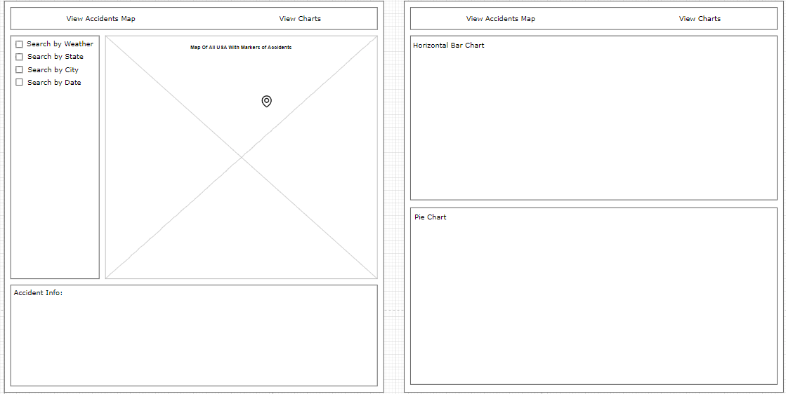
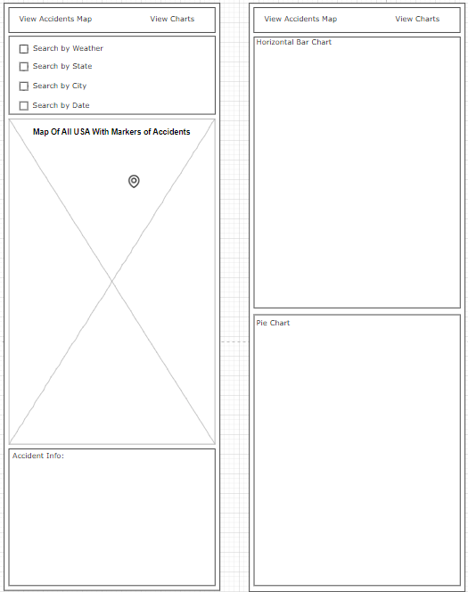

# WeatherWreck : Impact of Weather on US Accidents
## Data
[Issue Dataset](https://gitlab.com/dawson-csy3-24-25/520/section2/teams/TeamL-23-IanaMaaraYoury/520-project-purici-feniuc-nelson/-/issues/1)
2 Datasets: one from Us Weather Events and one from US Car Accidents which in 
combination can show us correlations to what weather conditions cause the most 
accidents on roads.

## API
GET /api/accidents :
This endpoint retrieves accidents details based on date & location of the accident.

GET /api/weather:
This endpoint retrives weather events details based on location & date of the events.

GET /api/accidents/state:
This endpoint retrieves accidents details based on the state of where the accident.
happened.

GET /api/weather/state:
This endpoint retrieves accidents details based on the state of where the event.
happened.

GET /api/weather/date:
This endpoint retrives weather events details based on date of the events.

GET /api/accidents/date:
This endpoint retrieves accidents details based on date of the accident.

GET /api/weather/type:
This endpoint retrives weather events details based on the type of event. ( rain,
storm, snow).

GET /api/accidents/severity:
This endpoint retrieves accidents details based on severity of the accident( 1 
to 4 where 1 is the least severe).

## Visualizations
1. Map of Accidents vs Weather Conditions 
Story :
  - By creating a dynamic map that shows location of accidents using color based 
  markers for weather conditions, the user will discover which areas are more 
  problematic ( accident-prone) during certain weather conditions. This also, can
  make them discover what location are more affected by certain conditons.

2. Graph of correlations between Weather & Accidents.
Story:
 - We're going to create a bar graph to display the pourcentage of accidents that
  occurs under certain weather conditons. This will informate the user about the 
  correlation of weather conditions & accidents. This graph will show what
  conditions represent most risks for car accidents.

3. Pie Chart of the Severity degree
Story 
  - This Pie chart will helps the user undetrand how certain weather conditions 
  can lead to more severe accidents or repercussions on victims. The user will 
  understand what weather he should be more careful in when choosing the drive.
## Views

  - For the main page (Accidents Map Page):
    - The nav bar will be above the fold
    - The mode menu and the map will be above the fold
    - The accident information box, used when the marker of an accident is clicked, it will be rendered below the fold

  - For the second page (Charts Page):
    - The nav bar will be above the fold
    - The horizontal bar chart, will be above the fold
    - The pie chart, will be below the fold

## Functionality
  - The user will be able to choose between viewing the main page and the second page by clicking the buttons in the nav bar
    - The main page is where the accidents map, the search mode and the accident info will be displayed
    - The second page is where the charts will be displayed

  - Each accident will be represented by a marker on the map
    - If the marker of an accident was clicked, more information about the accident will be fetched and display in the accident information box

  - The user will be able to check between the options to search accidednts based on the Weather, the State, the City and/or the Date
    - For the Date option, a small calendar will appear and the user will be able to chose a date to view all accidents that happened on the date
      - If no accidents happened on the chosen date, a message will be displayed in the accident information box 
    - For the other 3 options (Weather, State and City), a dropdown menu will appear with all the options the user can search by 
    - All the options can be mixed together so like that the user can search accidents that happened during a specific type of weather in a specific state and city, on a specific date

  - For the charts, if the user hovers over one of the bars/parts, more information will show up in a pop up

## Features and Priorities

## Dependencies
