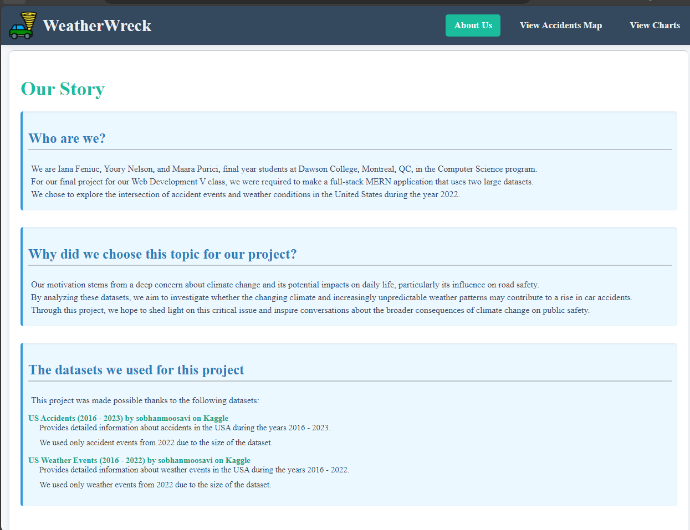
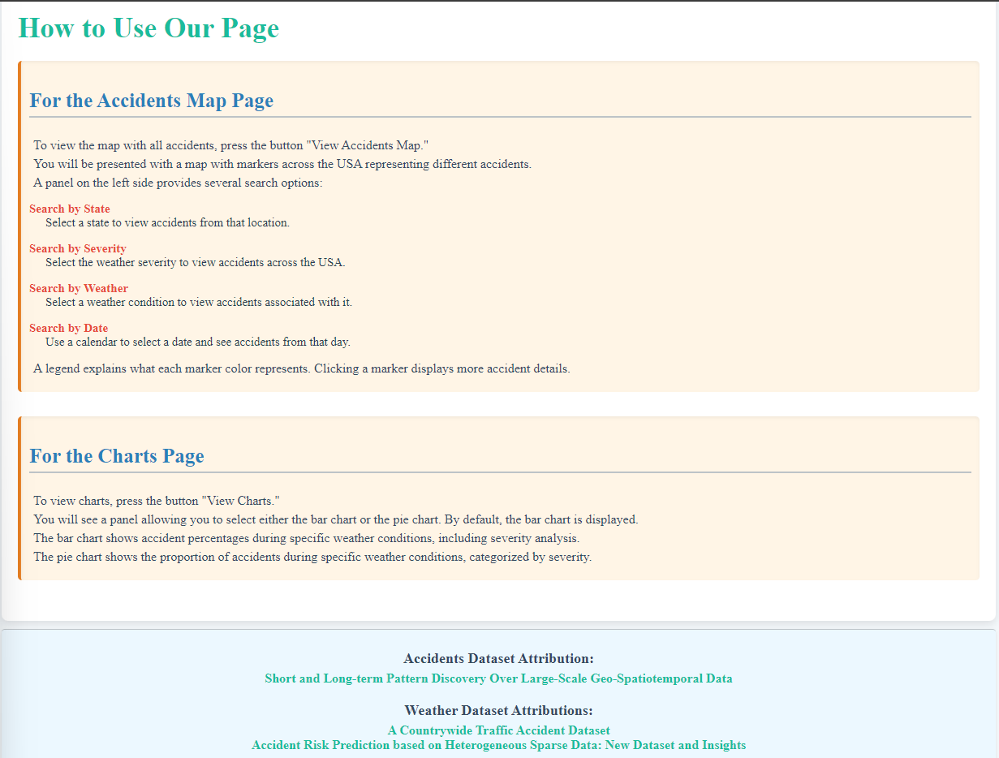
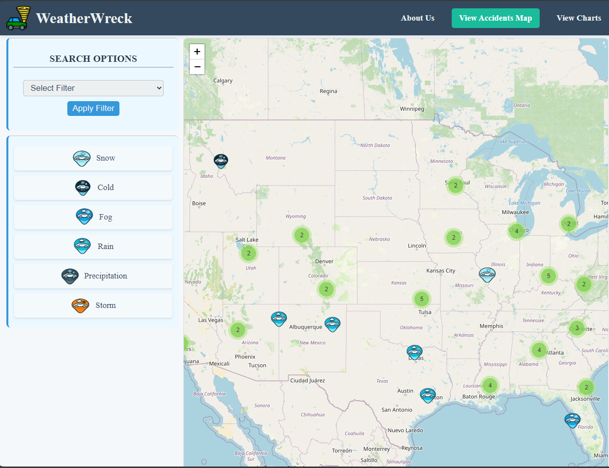
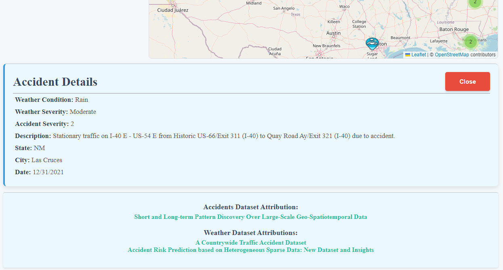
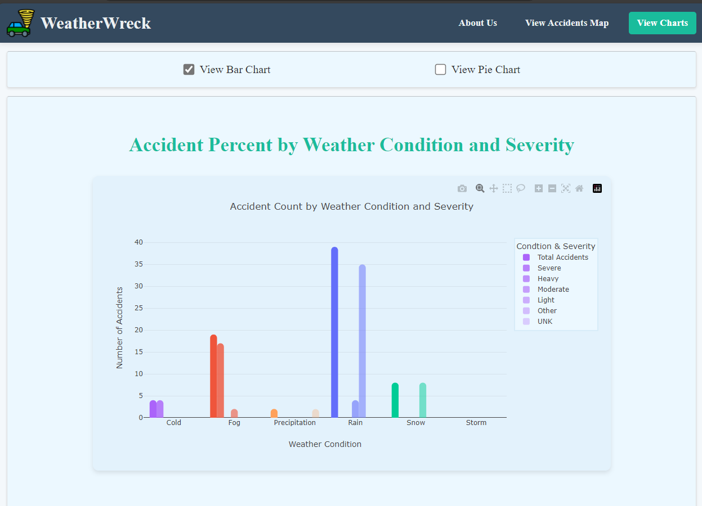
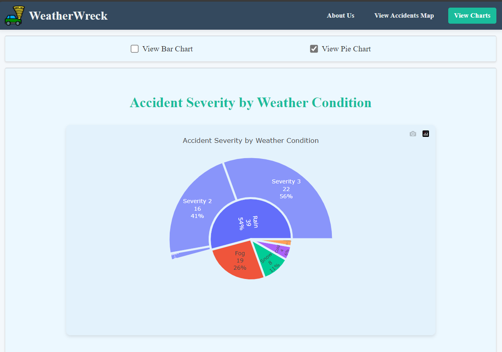

# WeatherWreck: Accident and weather visualizer

## Description: 
This project is a web application (MERN Stack) that visualizes car accidents and weather conditions. It displays an interactive map that will allow the user to view accidents, it will have features such as:
>   - Map Display: Accident locations and weather conditions are shown on a map, allowing users to explore data by region.
>   - Search Function: A search bar that lets users filter accidents or weather details by date, location, or severity.
>   - Detailed Charts: Clicking on a point on the map brings up charts with additional information, such as the time of the accident, its severity, and the weather conditions at that time.
>   - Interactive Data: Users can explore the map and charts to see patterns and connections between accidents and weather.

## Attributions (external resources): 
> Datasets used:  
>   - US Weather Events: https://www.kaggle.com/datasets/sobhanmoosavi/us-weather-events  
>        -  Based of this research: https://arxiv.org/abs/1902.06792  
>    - US Car Accidents: https://www.kaggle.com/datasets/sobhanmoosavi/us-accidents   
>         - Based of this research:   
>            - https://arxiv.org/abs/1906.05409 
>            - https://arxiv.org/abs/1909.09638

- https://leafletjs.com/examples/quick-start/ ( for map and markers)

> ### Licenses
> - Restictions/licenses if any: CC BY_NC_SA 4.0 - Attribution-Noncommercial-Sharelink 4.0 International (https://creativecommons.org/licenses/by-nc-sa/4.0/)

## Structure:
There are two directories in the root of the project.
- WeatherWreck contains all the code neede for runing the project
- Inside you will find 2 directories:
  * The Express server is in server/
  * The React app is in client/
  * The server responsd to API calls and serves the built React app.

## Setup:
1. Git clone https://gitlab.com/dawson-csy3-24-25/520/section2/teams/TeamL-23-IanaMaaraYoury/520-project-purici-feniuc-nelson.git
2. cd 520-project-purici-feniuc-nelson
3. cd WeatherWreck
4. npm run build
5. cd client/
6. npm install
7. cd ..
8. cd server/
9. npm install
10. create a new .env file in server foler & put the string to connect to the db like this:
ATLAS_URI= <...url...>
10. node util/seed.js

## To run the app:
1. cd client/
2. npm run dev
3. cd ..
4. open another console
5. cd server/
6. npm run dev

## Deployment
This project was deployed in two locations : 15.157.61.228 and Render https://weatherwreck.onrender.com/

<b>OPTION 1:</b> If you want to manually go through the process of deploying from scratch follow this  
1. Clone the repo  
`git clone https://gitlab.com/dawson-csy3-24-25/520/section2/teams/TeamL-23-IanaMaaraYoury/520-project-purici-feniuc-nelson.git`
2. In the repositiory `cd WeatherWreck`
3. From there run `cd client && NODE_ENV=developpment npm install && npm run build` to create the static files that the server will use
5. Go to the server folder `cd server`
6. From here, you need to install the dependencies but <b>ONLY FOR PRODUCTION</b> so run `NODE_ENV=production npm install` to install the dependencies but only for production
7. From there `cd ../../` to go outside of WeatherWreck
8. Now, you need to compress the files to pass them to the aws. You'll want to only pass the files that the aws will need to deploy the app so `tar -czvf WeatherWreck.tar.gz WeatherWreck/client/dist WeatherWreck/server/bin WeatherWreck/server/api.mjs WeatherWreck/server/routers WeatherWreck/server/controllers WeatherWreck/server/db WeatherWreck/server/node_modules` we include the node_modules because doing `npm install` might not work inside the deployment server (AWS) due to the memory limit, downloading all the dependencies is quite taxing on a server that isn't built for it.
9. Now that you have your compressed folder, pass it to the aws with scp  
`scp -r -i <your-private-key-to-your-aws> WeatherWreck.tar.gz bitnami@15.157.61.228:~`
10. Now log into your AWS console and extract the folder `tar -xvf WeatherWreck.tar.gz`  
NOTE: We assume that you already set up you're .env in your aws server that connects to the production database. If you already set it up, don't worry, extracting the updated folders won't overwrite that file.
11. Then, simply `cd WeatherWreck/server && NODE_ENV=production PORT=3001 bin/www.js` to start the server, or `cd WeatherWreck/server && NODE_ENV=production PORT=3001 forever restart bin/www.js` if you already have it running.
12. Then, go to the address passed at the top of these steps and voila! You're web application is deployed!

<b>OPTION 2:</b> Deploy using the artifact

<b>OPTION 2.1 </b> Getting from your own tag
1. `git checkout main` or staging
2. Make a tag to trigger the build-app-artifact `git tag -a tag_name -m "description"`
3. Push the tag `git push orgin tag_name`
4. 
1. Get the artifact from the most recent `build-app-artifact` job.
2. Pass it to the aws   
`scp -r -i <your-private-key-to-your-aws> WeatherWreck.tar.gz bitnami@15.157.61.228:~`
3. Now log into your AWS console and extract the folder `tar -xvf WeatherWreck.tar.gz`
4. Then, simply `cd WeatherWreck/server && NODE_ENV=production PORT=3001 bin/www.js` to start the server, or `cd WeatherWreck/server && NODE_ENV=production PORT=3001 forever restart bin/www.js` if you already have it running.
5. Then, go to the address passed at the top of these steps and voila! You're web application is deployed!

## UI Screenshots

### About page
###### Above the fold:

###### Bellow the fold:

### Accidents View
###### Above the fold:

###### Bellow the fold:

### Charts View
#### Bar Chart

#### Pie Chart
